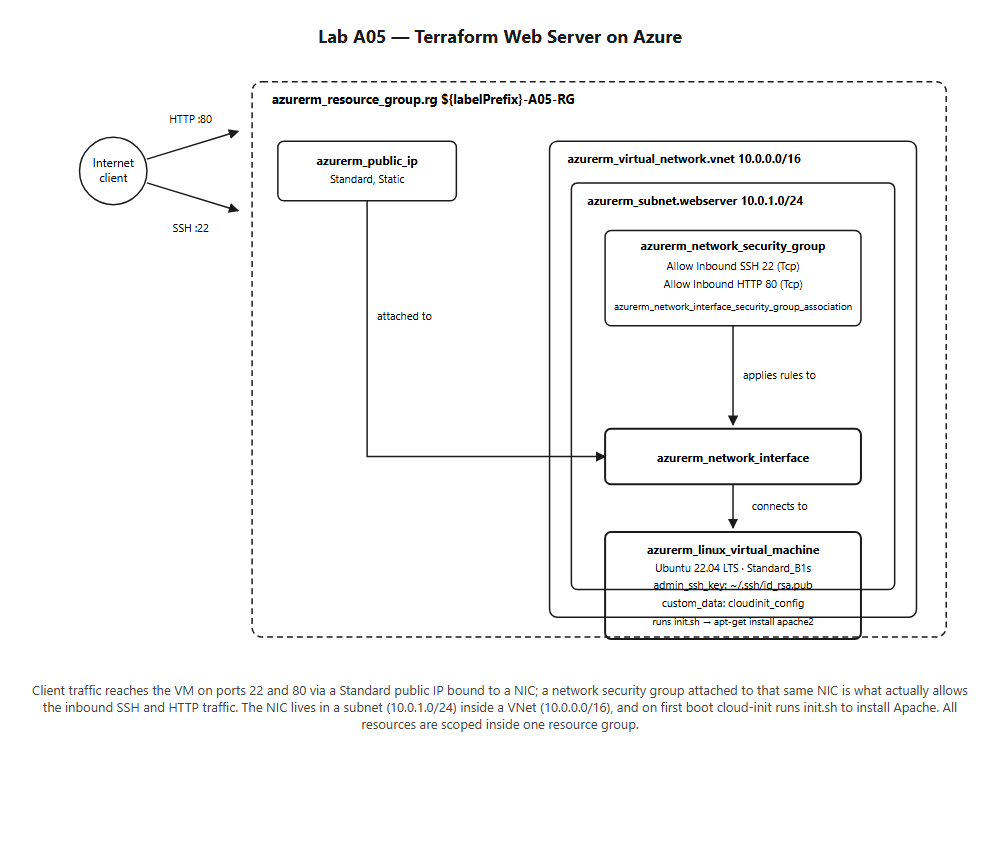

# cst8918_Lab-A05

CST8918 - DevOps: Infrastructure as Code
LAB-A05 Terraform Web Server

## Scenario

A single-server web application is being moved from an office to Azure. This lab provisions the first version of that server with Terraform: a publicly reachable Ubuntu VM running Apache, reachable over SSH and HTTP.

## Architecture



All resources live in one resource group. A Standard public IP is bound to a NIC, which is attached to the VM and has a network security group allowing inbound TCP 22 (SSH) and TCP 80 (HTTP). The NIC sits in a subnet (`10.0.1.0/24`) inside a VNet (`10.0.0.0/16`). On first boot, cloud-init runs [init.sh](init.sh) to install Apache.

## Resources

Everything is defined in [main.tf](main.tf):

- `azurerm_resource_group.rg`
- `azurerm_public_ip.webserver` (Standard SKU, static allocation)
- `azurerm_virtual_network.vnet`
- `azurerm_subnet.webserver`
- `azurerm_network_security_group.webserver` (inline SSH + HTTP rules)
- `azurerm_network_interface.webserver`
- `azurerm_network_interface_security_group_association.webserver`
- `data.cloudinit_config.init`
- `azurerm_linux_virtual_machine.webserver`

All resource names are derived from the `labelPrefix` variable.

> [!NOTE]
> `Standard_B1s` had no capacity available in WestUS3 for this subscription at deploy time, so the VM size was changed to `Standard_D2s_v3`.

## Usage

```bash
terraform init
terraform apply
```

You'll be prompted for `labelPrefix` (your college username). Once applied, Terraform prints the resource group name and public IP.

```bash
# Browse to the default Apache page
curl http://<public_ip>/

# SSH in
ssh azureadmin@<public_ip>
```

See [a05-demo.png](a05-demo.png) for a demo of both.

## Clean up

```bash
terraform destroy
```
